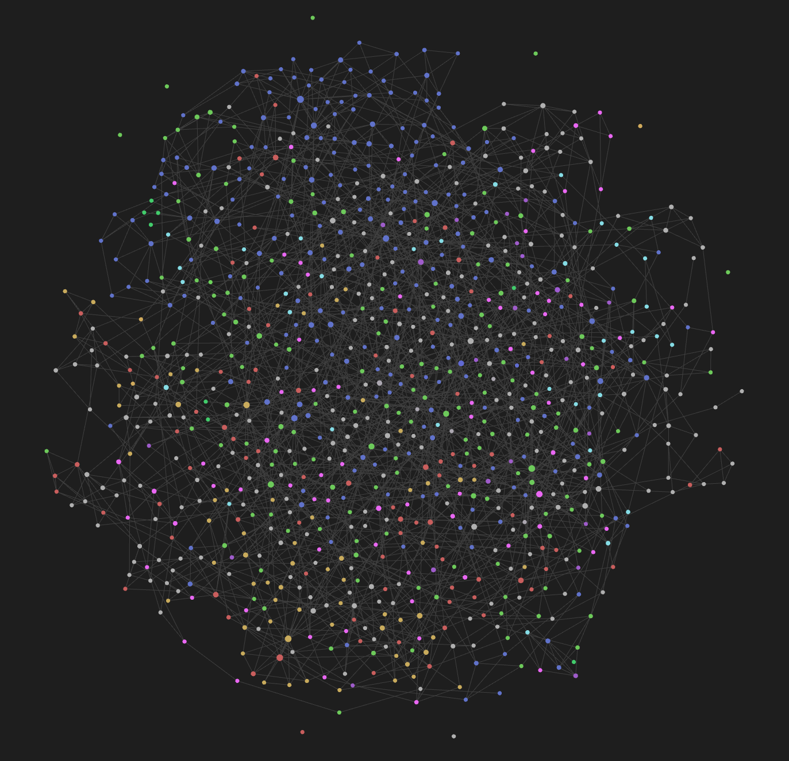

# Metisem:  Semantic Linking Script

## Warning! In current config this will remove all existing links from your files when run. Amend the code before running if you don't want this to happen.

## Project Overview

A script to automatically link notes based on **semantic similarity**. Using **sentence embeddings** and **clustering techniques**, it creates connections between notes based on their content and titles, allowing users to navigate their knowledge base more intuitively. It works on any library of markdown .md files but was originally developed to work across a full **Obsidian** vault.

<em>Screenshot of Obsidian graph with 961 md files (chats) imported from ChatGPT linked using metisem </em>


The script uses **PyTorch**, **sentence-transformers**, and **scikit-learn** for embedding generation, semantic similarity calculation, and clustering. The embeddings are processed using **CUDA** (if available) to optimize performance on GPUs.

## Features

- **Semantic linking** of notes based on both titles and content.
- Supports **customizable weightings** for title and content embeddings.
- **Hierarchical clustering** to group notes into meaningful clusters.
- Automatically updates Obsidian notes with links to semantically related notes.
- Optimized for **CUDA-enabled GPUs** to speed up embedding generation.
- Easily configurable via command line arguments for cluster count, similarity thresholds, and embedding weights.

## Requirements

Before you begin, ensure you have the following installed on your system:

- **Python 3.8+**
- **CUDA-enabled GPU** (optional, but recommended for faster processing)
- **Obsidian** (knowledge base software)

## Installation and Setup

### Step 1: Clone the Repository

```bash
git clone <repo_url>
cd <repo_directory>
```

### Step 2: Set Up the Python Environment

1. Run the provided script to set up the environment:
   - On **Windows**:
     ```bash
     setup_environment.bat
     ```
   - On **Linux/macOS**:
     ```bash
     chmod +x setup_environment.sh
     ./setup_environment.sh
     ```

2. This will create a Python virtual environment, activate it, and install the necessary packages, including **torch**, **transformers**, **scikit-learn**, and **sentence-transformers**.

### Step 3: Activate the Virtual Environment

- On **Windows**:
  ```bash
  venv\Scripts\activate
  ```
- On **Linux/macOS**:
  ```bash
  source venv/bin/activate
  ```

### Step 4: Verify CUDA Installation (Optional)

If you have a CUDA-enabled GPU, verify that PyTorch is using it by running:

```bash
python -c "import torch; print(torch.cuda.is_available())"
```

If this returns `True`, you're ready to leverage GPU acceleration for embedding generation.

### Step 5: Run the script

To run the script and perform semantic linking on your Obsidian vault, execute the following command:

```bash
python main.py --clusters 40 --similarity 0.75 --title-weight 0.6 --content-weight 0.4 --batch-size 16 --force-embeddings
```

#### Command Line Arguments

- `--clusters`: Number of clusters for **Agglomerative Clustering** (default: 30).
- `--similarity`: Similarity threshold for linking notes (default: 0.7).
- `--title-weight`: Weight for title embeddings in the combined similarity score (default: 0.5).
- `--content-weight`: Weight for content embeddings in the combined similarity score (default: 0.5).
- `--batch-size`: Batch size for processing embeddings (default: 16).
- `--force-embeddings`: Forces the script to regenerate embeddings even if they already exist.

### Step 6: Deactivate the Environment

When you're done, deactivate the virtual environment with:

```bash
deactivate
```

## Customization and Contribution

Feel free to modify the code to suit your needs. You can adjust the clustering settings, add additional features, or contribute to the codebase by submitting a pull request.

### Contributing

1. Fork the repository.
2. Create your feature branch (`git checkout -b feature/your-feature`).
3. Commit your changes (`git commit -m 'Add some feature'`).
4. Push to the branch (`git push origin feature/your-feature`).
5. Open a pull request.

## Troubleshooting

If you encounter any issues, please ensure that:

- **CUDA** is installed correctly on your system.
- The **correct version of PyTorch** is installed (with CUDA support).
- You're using a **compatible Python version** (3.8 or higher).

For additional help, feel free to open an issue or contact the project maintainers.

## License

This project is licensed under the MIT License - see the [LICENSE](LICENSE) file for details.

## Acknowledgements

- [Obsidian](https://obsidian.md) for their fantastic knowledge base software.
- [Hugging Face](https://huggingface.co) for providing access to models and tools for natural language processing.
- [PyTorch](https://pytorch.org) and [Transformers](https://huggingface.co/transformers/) for enabling fast, GPU-accelerated model processing.
- [ChatGPT4o](https://chatgpt.com) for help with the coding and write up.
